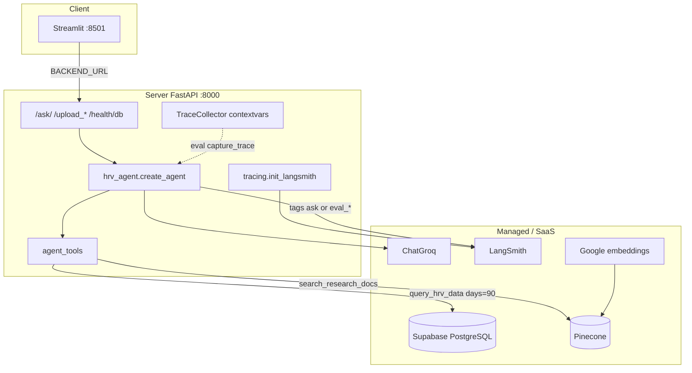
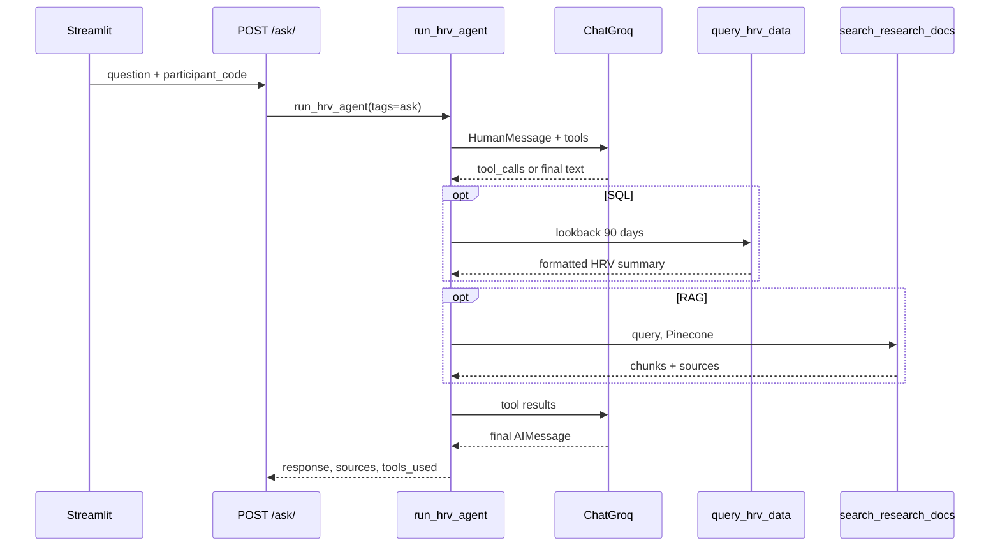
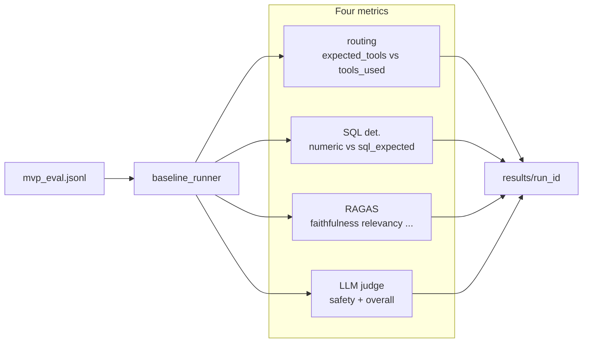

# Architecture (v1)

현재 코드 기준입니다. **3단계**(키워드 classifier + 미리 SQL/RAG 조회)와 **4단계 Agent 전환 직후** 복습 문서(`.cursor/plans/architecture_4단계_agent.plan.md`)와 구분하세요.

이 문서는 Agent 위에 올라간 **Eval + LangSmith + Docker**까지 포함합니다.

---

## 3단계 → 4단계 → v1

| | 3단계 | 4단계 Agent | v1 (지금) |
|--|--------|-------------|-----------|
| 라우팅 | `query_classifier` 키워드 | LLM + tool docstring | 동일 |
| 조회 | LLM 전에 항상 조회 | 필요할 때만 Tool | 동일 |
| 관측 | 없음 | `tools_used`만 | LangSmith + `TraceCollector` (eval) |
| 품질 | 없음 | 없음 | 4영역 eval + compare |
| 배포 | 로컬 / Render | 동일 | + Docker Compose |

프로덕션 진입점은 그대로 `POST /ask/` → `run_hrv_agent()`. `query_classifier.py`는 레거시로 남아 있고 ask 경로에서는 쓰이지 않습니다.

---

## Components

| 구성 | 역할 |
|------|------|
| `client/` | 업로드 + 채팅. `BACKEND_URL` 없으면 `127.0.0.1:8000` |
| `server/main.py` | FastAPI lifespan: LangSmith init, `create_all` |
| `server/modules/hrv_agent.py` | 시스템 프롬프트 + `create_agent` |
| `server/modules/agent_tools.py` | `query_hrv_data`, `search_research_docs` |
| `server/modules/sql_handlers.py` | 실제 SQL (eval expected와 **코드 경로 분리**) |
| `server/modules/rag_handlers.py` | Pinecone top_k |
| `server/modules/trace_collector.py` | 요청별 tool 결과 (eval 메트릭용) |
| `server/modules/tracing.py` | LangSmith env, RAGAS/judge는 `without_tracing()` |
| `server/eval/` | golden set, runner, RAGAS, judge, compare, failure_report |

Docker는 FastAPI와 Streamlit만 감쌉니다. Postgres는 계속 Supabase입니다.

---

## Agent loop

도구는 종류당 최대 1회를 프롬프트·docstring으로 유도합니다. 증상·약 질문은 도구를 호출하지 않고 coordinator/의사로 넘깁니다.

---

## Eval framework (4영역)

채팅과 같은 `run_hrv_agent`를 쓰되 `capture_trace=True`입니다. UI를 거치지 않습니다.

| 영역 | 입력 | 점수 |
|------|------|------|
| Routing | `expected_tools` vs 실제 tool 이름 | exact / P / R / F1 |
| SQL | `sql_expected.json` vs trace의 `sql_result` | pass (tolerance) |
| RAG | 답 + 검색 청크 + reference | RAGAS 4지표 |
| Final | 답 + safety 플래그 | judge 1–5, safety pass |

실패 분류는 `failure_report.py` (routing / sql / rag / safety / out_of_scope / repeated_tools / …).

SQL **expected**는 `compute_sql_truth.py`가 픽스처 CSV만 읽고, **actual**은 프로덕션 `build_sql_result`입니다. 같은 함수로 정답을 만들면 안 됩니다.

---

## LangSmith layer

`init_langsmith()`는 `LANGSMITH_TRACING`이 켜져 있고 키가 있을 때만 활성화합니다. 없으면 경고 후 계속합니다.

- `/ask/` → run name `ask`, 태그 `ask`
- eval → run name = `eval_007` 등, 태그 `eval`, `eval_<run_id>`, category, example id
- RAGAS/judge → `without_tracing()` 으로 제외

로컬 uvicorn, Docker `env_file`, Render 환경변수가 같으면 한 프로젝트(`medical-ai-assistant`)에 쌓입니다. 품질 숫자(CSV)는 eval 러너가 저장하고, LangSmith는 **호출 트리·지연·토큰**을 봅니다.
