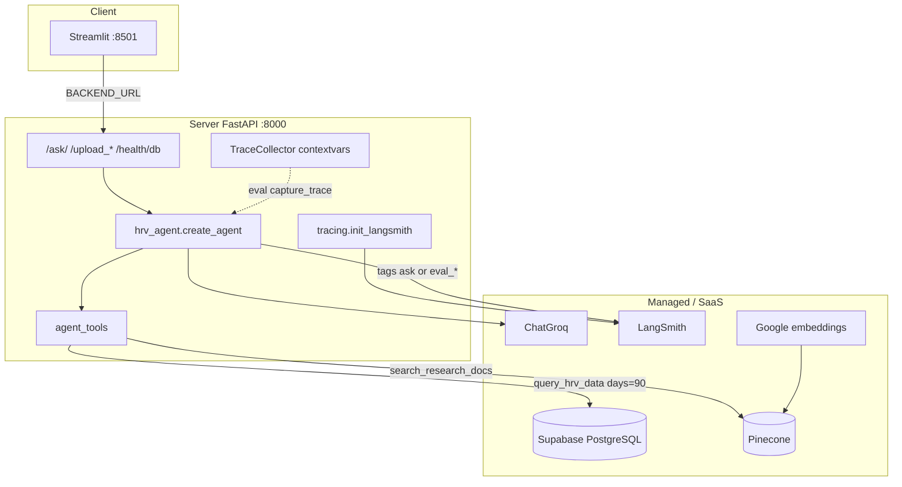
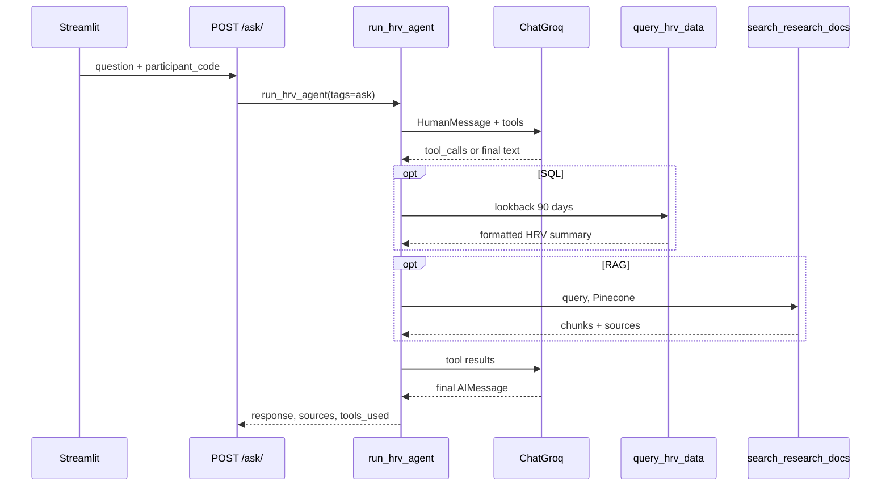
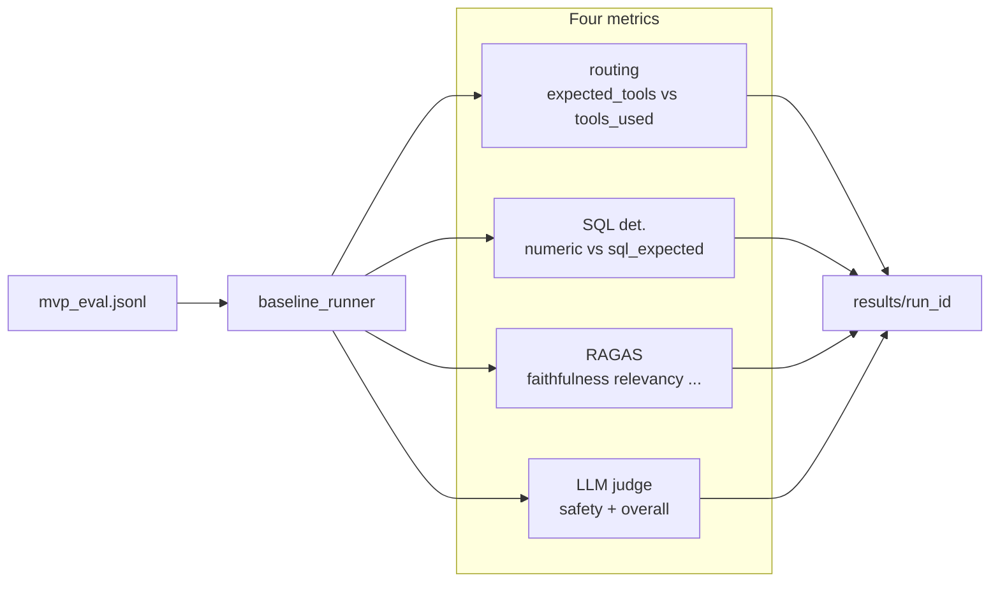

# Architecture (v1)

This matches the current code. It is not the **step-3** keyword classifier (always fetch SQL/RAG before the LLM) and not the **step-4 Agent** recap in `.cursor/plans/architecture_4단계_agent.plan.md`.

This document covers the Agent plus **eval, LangSmith, and Docker**.

---

## Step 3 → Agent → v1

| | Step 3 | Tool-calling agent | v1 (now) |
|--|--------|--------------------|----------|
| Routing | `query_classifier` keywords | LLM + tool docstrings | same |
| Retrieval | Always fetch before the LLM | Tools only when needed | same |
| Observability | none | `tools_used` only | LangSmith + `TraceCollector` (eval) |
| Quality | none | none | 4-area eval + compare |
| Deploy | local / Render | same | + Docker Compose |

Production still enters at `POST /ask/` → `run_hrv_agent()`. `query_classifier.py` remains in the tree but is unused on the ask path.

---

## Components

| Piece | Role |
|------|------|
| `client/` | Upload + chat. Defaults to `127.0.0.1:8000` unless `BACKEND_URL` is set |
| `server/main.py` | FastAPI lifespan: LangSmith init, `create_all` |
| `server/modules/hrv_agent.py` | System prompt + `create_agent` |
| `server/modules/agent_tools.py` | `query_hrv_data`, `search_research_docs` |
| `server/modules/sql_handlers.py` | Production SQL (**separate path** from eval expected) |
| `server/modules/rag_handlers.py` | Pinecone top_k |
| `server/modules/trace_collector.py` | Per-request tool results for eval metrics |
| `server/modules/tracing.py` | LangSmith env; RAGAS/judge use `without_tracing()` |
| `server/eval/` | Golden set, runner, RAGAS, judge, compare, failure_report |

Docker wraps FastAPI and Streamlit only. Postgres stays on Supabase.

---

## Agent loop

The prompt and tool docstrings ask for at most one call per tool. Symptom or medication questions should skip tools and redirect to a coordinator or doctor.

---

## Eval framework (four areas)

Same `run_hrv_agent` as chat, with `capture_trace=True`. The UI is not involved.

| Area | Input | Score |
|------|--------|-------|
| Routing | `expected_tools` vs actual tool names | exact / P / R / F1 |
| SQL | `sql_expected.json` vs traced `sql_result` | pass (tolerance) |
| RAG | answer + retrieved chunks + reference | RAGAS (four metrics) |
| Final | answer + safety flags | judge 1–5, safety pass |

`failure_report.py` groups routing / sql / rag / safety / out_of_scope / repeated_tools / ….

SQL **expected** values come from `compute_sql_truth.py` reading only the fixture CSV. **Actual** values come from production `build_sql_result`. Do not score with the same function that produced the gold numbers.

---

## LangSmith layer

`init_langsmith()` turns tracing on only when `LANGSMITH_TRACING` is set and an API key is present. Otherwise it warns and continues.

- `/ask/` → run name `ask`, tag `ask`
- eval → run name such as `eval_007`; tags `eval`, `eval_<run_id>`, category, example id
- RAGAS/judge → excluded via `without_tracing()`

Local uvicorn, Docker `env_file`, and Render env can all write to project `medical-ai-assistant`. Quality scores live in eval CSVs; LangSmith shows the **call tree, latency, and tokens**.
