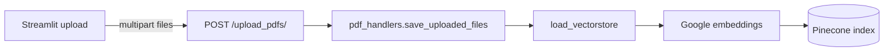
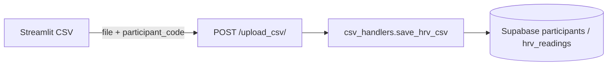
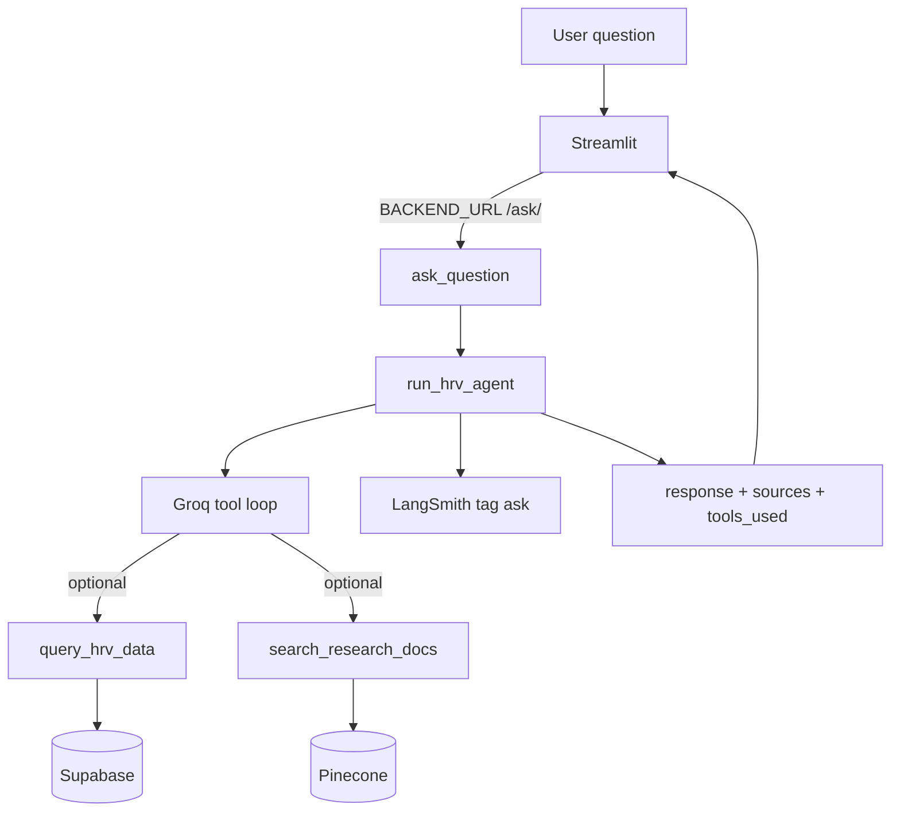
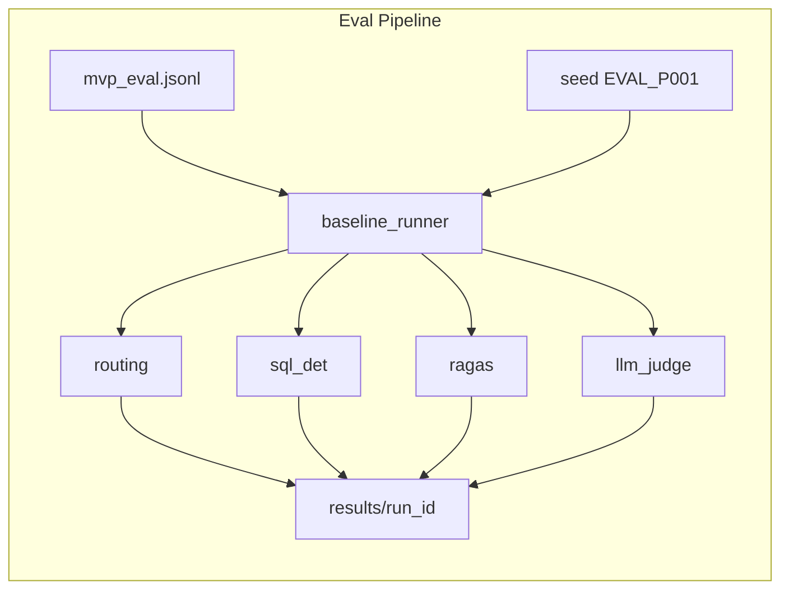
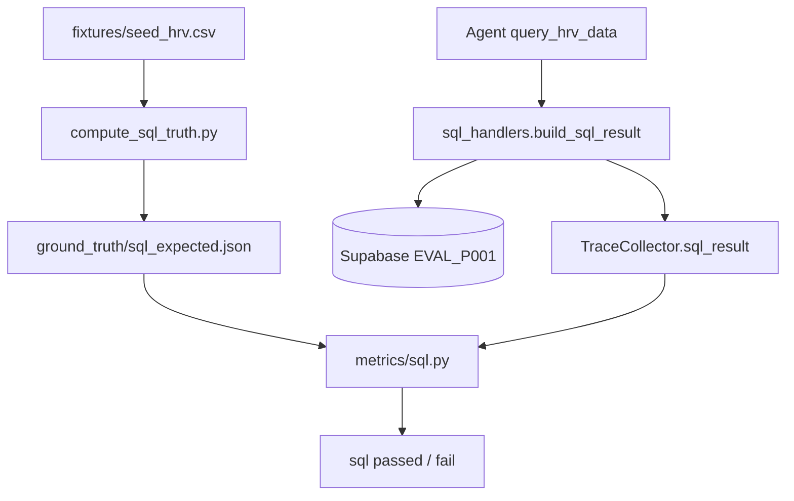
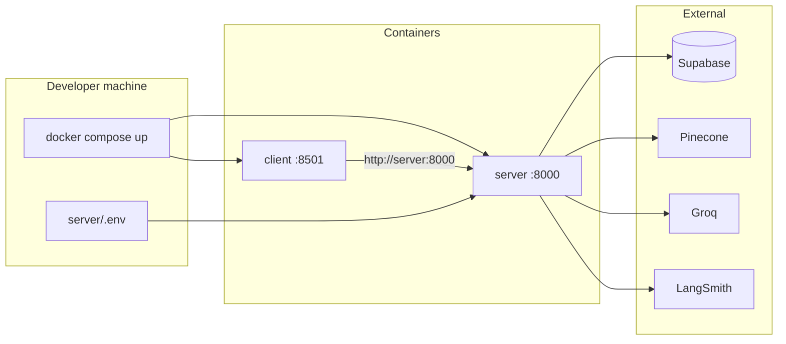

# Data flow

How requests move through storage, the agent, and the eval pipeline. Component list: [architecture.md](architecture.md).

---

## PDF ingest (RAG)

1. The client posts PDFs to `POST /upload_pdfs/`.
2. The server saves them locally, splits text, and embeds.
3. Chunks land in Pinecone. Later, `search_research_docs(query)` searches that index.

---

## CSV ingest (SQL)

1. A CSV is uploaded with `participant_code` (default `P001`).
2. Rows are written to PostgreSQL `hrv_readings`.
3. The agent's `query_hrv_data` aggregates the **last 90 days** only (`days=90`).

Eval participant `EVAL_P001` is loaded from `server/eval/fixtures/seed_hrv.csv` via `seed_db.py`, not from the UI.

---

## Ask (production)

- Local: no `BACKEND_URL` → `http://127.0.0.1:8000`
- Docker: `BACKEND_URL=http://server:8000` (Compose service name)
- Symptom, medication, or emergency cues should skip tools and use the safety redirect.
- Unrelated non-medical questions (weather, coding) skip tools and stay in the HRV-only fallback. Eval treats **safety** and **out_of_scope** as different categories.

---

## Eval pipeline

1. `--seed-db` (default) reseeds `EVAL_P001` from the fixture.
2. Each `EvalExample` line runs through `run_eval_example` → `run_hrv_agent(..., capture_trace=True)`.
3. Four metric areas are scored into `details.jsonl` / `summary.csv` / `metadata.json` (git commit, models, LangSmith tag).
4. `compare.py` writes baseline vs candidate deltas.
5. `failure_report.py` groups failure types and adds LangSmith filter hints.

Asking questions in Streamlit does not write these CSVs.

---

## SQL ground truth vs actual

Gold numbers and the live query use different code so scoring cannot be circular.

- **Expected:** independent script over the CSV + reference date + lookback. It does not import production SQL modules.
- **Actual:** runtime `build_sql_result` only. Eval compares the traced numbers to expected.

Production lookback is 90 days; the fixture span is about 30 days. `expected_date_range_days` is the **tool lookback**, not the fixture window.

---

## Docker deploy

1. Images: `Dockerfile.server` (uv + `pyproject.toml`), `Dockerfile.client` (Streamlit).
2. `.dockerignore` keeps `.env`, `.venv`, and eval results out of the image. Keys enter only via runtime `env_file`.
3. Browser → `:8501` → `server:8000` on the Compose network → cloud DB/LLM.

Local development can skip Compose and use uvicorn + Streamlit. The eval runner is not in the image CMD; run it from the host `.venv`.
