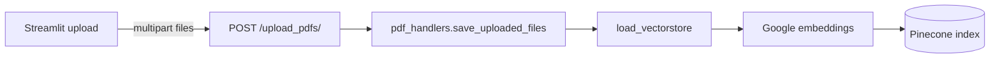
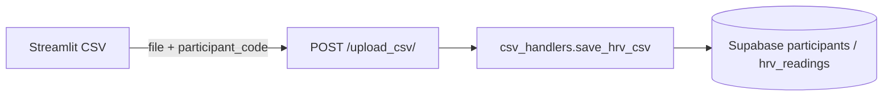
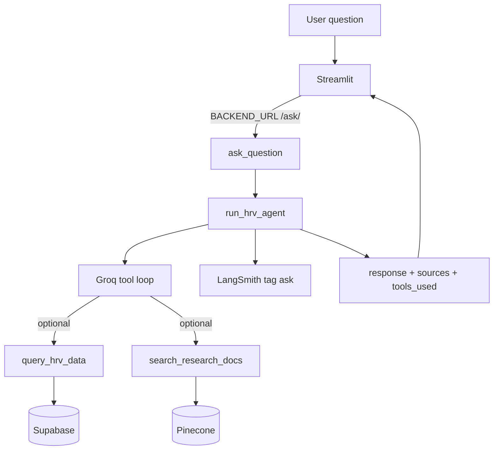
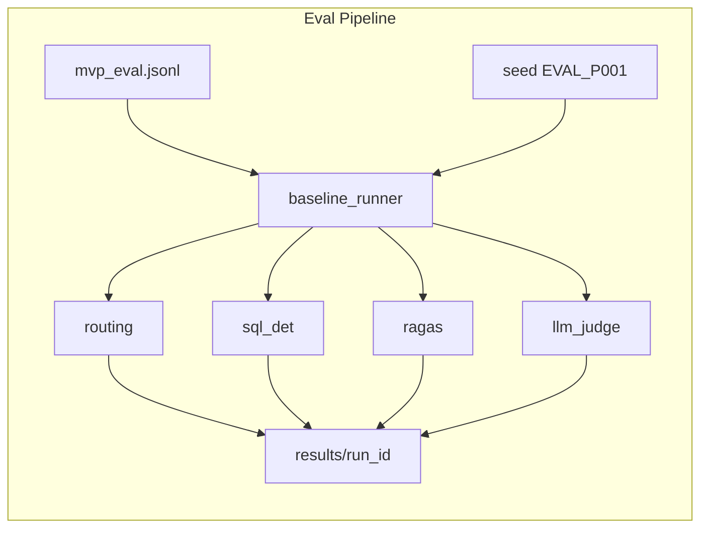
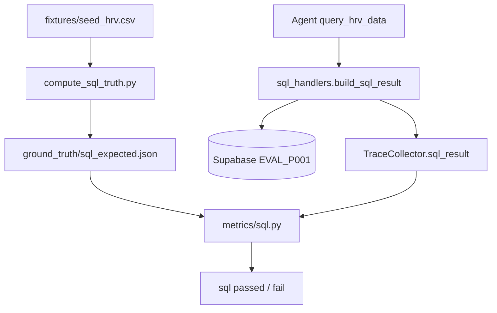
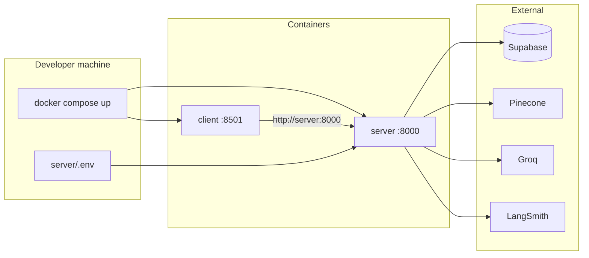

# Data flow

요청이 저장소·Agent·평가 파이프라인을 어떻게 지나는지입니다. 구성 요소 목록은 [architecture.md](architecture.md)를 보세요.

---

## PDF ingest (RAG)

1. 클라이언트가 PDF를 `POST /upload_pdfs/`로 보냅니다.
2. 서버가 로컬에 저장한 뒤 텍스트를 쪼개 임베딩합니다.
3. 청크가 Pinecone에 올라갑니다. 이후 `search_research_docs(query)`가 이 인덱스를 검색합니다.

---

## CSV ingest (SQL)

1. `participant_code`(기본 `P001`)와 CSV가 함께 올라갑니다.
2. 행이 PostgreSQL `hrv_readings`에 들어갑니다.
3. Agent의 `query_hrv_data`는 **최근 90일**만 집계합니다 (`days=90` 고정).

평가 참가자 `EVAL_P001`은 UI 업로드가 아니라 `server/eval/fixtures/seed_hrv.csv` + `seed_db.py`로 넣습니다.

---

## Ask (production)

- 로컬: `BACKEND_URL` 없음 → `http://127.0.0.1:8000`
- Docker: `BACKEND_URL=http://server:8000` (compose 서비스 이름)
- 증상·약·응급 단서는 도구를 건너뛰고 safety 문구로 끝내는 것이 목표입니다.
- 날씨 등 비의료 범위 밖은 도구 없이 HRV 전용 안내입니다. (safety와 out_of_scope는 eval에서 다른 카테고리)

---

## Eval pipeline

1. `--seed-db`(기본)가 `EVAL_P001`을 픽스처로 다시 넣습니다.
2. 각 줄(`EvalExample`)을 `run_eval_example` → `run_hrv_agent(..., capture_trace=True)`로 실행합니다.
3. 네 영역 점수를 매기고 `details.jsonl` / `summary.csv` / `metadata.json`(git commit, 모델, LangSmith 태그)을 씁니다.
4. `compare.py`가 baseline vs candidate 델타를 만듭니다.
5. `failure_report.py`가 실패 유형을 묶고 LangSmith 필터 힌트를 붙입니다.

Streamlit에서 질문해도 이 CSV는 생기지 않습니다.

---

## SQL ground truth vs actual

순환 채점을 막기 위해 정답과 실행 경로를 나눕니다.

- **Expected:** CSV + 기준일 + lookback을 독립 스크립트가 계산. 프로덕션 SQL 모듈을 import하지 않습니다.
- **Actual:** 런타임 `build_sql_result`만. eval은 trace에 담긴 숫자와 expected를 비교합니다.

프로덕션 lookback은 90일, 픽스처 데이터 폭은 약 30일입니다. `expected_date_range_days`는 **툴 lookback**이지 픽스처 기간이 아닙니다.

---

## Docker deploy

1. 이미지: `Dockerfile.server` (uv + `pyproject.toml`), `Dockerfile.client` (Streamlit).
2. `.dockerignore`가 `.env`와 `.venv`, eval 결과를 이미지에서 제외합니다. 키는 **런타임 `env_file`** 로만 들어갑니다.
3. 브라우저 → `:8501` → 같은 compose 네트워크의 `server:8000` → 클라우드 DB/LLM.

로컬 개발은 compose 없이 uvicorn + streamlit이어도 됩니다. 평가 러너는 이미지 CMD에 없고, 호스트 `.venv`에서 실행합니다.
